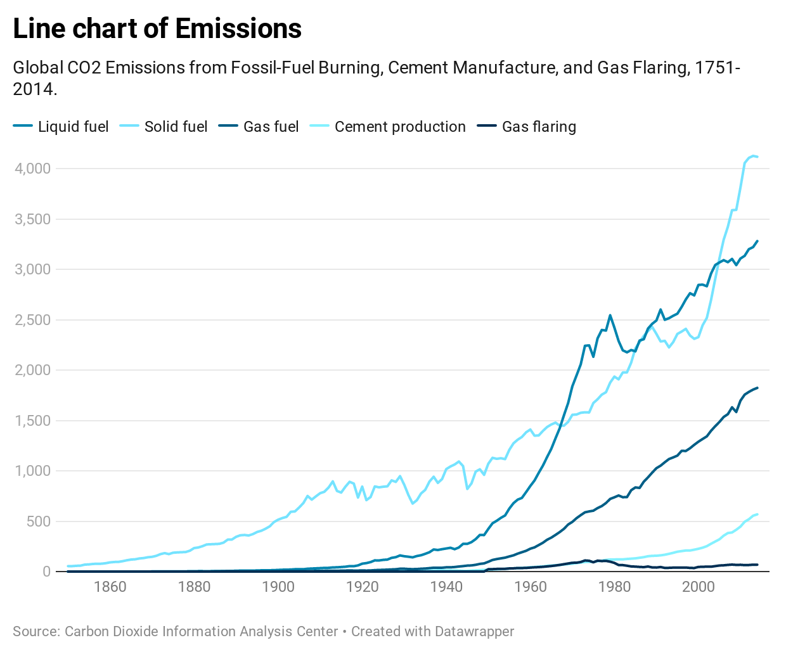
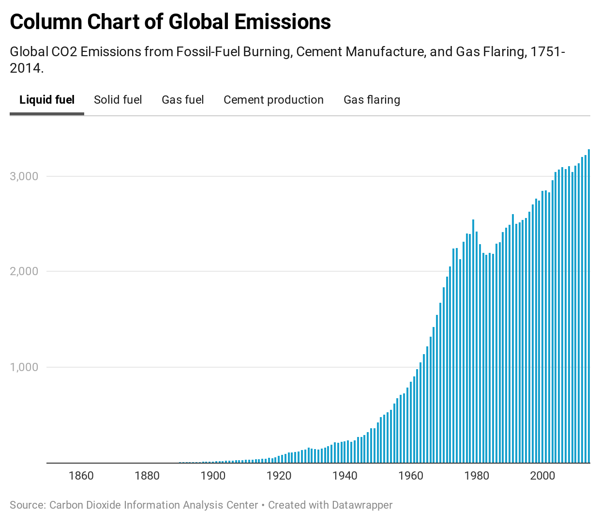

# Ryan McGuiness

Hello! I am Computer Science and Economics major at Lehigh University.
I came into Lehigh as a January admit and have been working hard to graduate with the class of 2021.
I am a Software Developer and love to make clean and easy to follow UI.
I'm interning at start up company while also doing projects on the side.
A few of my projects include a personal resume page at [ryanmcguiness.com](https://ryanmcguiness.com).
I have also created a website that provides book recomendations which could be seen at [booksthatmakeyousmarter.com](https://booksthatmakeyousmarter.com). It is an amazon associated website, so whenever people purchase a book, I recieve a percentage.

# US Beer Consumption
-Author: Ryan McGuiness
- Data Source: https://www.ttb.gov/beer/statistics
The map below shows the consumption of beer across the United  States. I was not directly looking for this data set, but it had  very neat data that had a lot of useful variables. The operations that I mostly used in this representation was geo-location and sum. With these two functions I was able to put together this map that makes it easy to tell which states consume the most kegs and barrels. The pie chart on the bottom right is the representation of bottle and can consumption. Not much changed, however Colorado did take the lead away from California in bottle and can consumption. With this data alcoholic beverage companies can better focus their advertisements to capture more of the market at a lower cost, by focusing their adds by location.

<noscript>

</noscript>
<object class='tableauViz'  style='display:none;'>
<param name='host_url' value='https%3A%2F%2Fpublic.tableau.com%2F' /> <param name='embed_code_version' value='3' /> 
<param name='path' value='shared&#47;GJB68KQDK' /> 
<param name='toolbar' value='yes' />
<param name='static_image' value='https:&#47;&#47;public.tableau.com&#47;static&#47;images&#47;GJ&#47;GJB68KQDK&#47;1.png' /> 
<param name='animate_transition' value='yes' />
<param name='display_static_image' value='yes' />
<param name='display_spinner' value='yes' />
<param name='display_overlay' value='yes' />
<param name='display_count' value='yes' />
<param name='language' value='en' />
<param name='filter' value='publish=yes' />
</object>

                

# #BLM Visualization

This grah provides a visualization of the black lives matter hashtag across the United States. As you can tell from the graph this righteous movement has swept the nation. The heat map shows that this movment has gained traction almost everywhere. There are some cold spots in the central states, which could be easily explained by the majority of white population living in those states. I am definitely not saying that their failuer to participate in this movement is justified, but is not shocking. It is also visible that these hashtags are being tweeted near the areas that are having protests.

<iframe width="500" height="400" frameborder="0" scrolling="no" marginheight="0" marginwidth="0" title="BLM Movement" src="//lu.maps.arcgis.com/apps/Embed/index.html?webmap=5f390d2037fd44c597c48152b7722d36&extent=-135.4639,21.5808,-41.7725,57.2582&zoom=true&previewImage=true&scale=true&disable_scroll=true&theme=dark">
</iframe>

